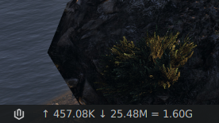

# ↑↓ Internet Speed Monitor

A Gnome extension to Monitor Internet Speed and Daily Data Usage in an elegant and minimal fashion.

## Table of Contents

* [Screenshot](#screenshot)
* [Features](#features)
* [Getting Started](#getting-started)
  + [Prerequisite:](#prerequisite-)
    - [Install Gnome Tweaks](#install-gnome-tweaks)
  + [Install Internet Speed Monitor from Gnome Extensions](#install-internet-speed-monitor-from-gnome-extensions)
  + [Install Internet Speed Monitor from source](#install-internet-speed-monitor-from-source)
* [Contributing](#contributing)
* [Thanks to](#thanks-to)
* [License](#license)


## Screenshot



## Features

This extension has following features:

- Shows internet upload speed and download speed minimally
- Shows daily data usage since midnight
- Position of the extension is set on left hand side
- Upload and Download speeds are shown after '↑' and '↓' respectively.
- Speed is shown with just one letter
   + K means KB/s
   + M means MB/s
   + G means GB/s
   + T means TB/s
- Similarly, data used is also shown with one letter after '=' symbol.
- To reset the data used value manually anytime, run the following command. You can even make an alias of this command for easier use.
   ```
   sed -i '1s;^;0\n;' ~/.local/share/gnome-shell/extensions/InternetSpeedMonitor@Rishu/last 
   ```
- If encountered any error, it prints the error in place
   of the extension so that the user if capable and solve it on their own.

## Getting Started

To use this extension, you will need

- Gnome Shell 3.20 or later

### Prerequisite: Install Gnome Tweaks

For Ubuntu,

```bash
sudo add-apt-repository universe
sudo apt install gnome-tweaks
```

For Fedora,

```bash
sudo dnf install gnome-tweaks
```

For Arch Linux,

```bash
sudo pacman -S gnome-tweak-tool
```

You may find Gnome Tweaks for other distributions as well. Install them accordingly.

### Install Internet Speed Monitor from Gnome Extensions

Visit [Internet Speed Monitor - GNOME Shell Extensions](https://extensions.gnome.org/extension/4585/internet-speed-monitor/) 

### Install Internet Speed Monitor from source

1. Clone this repository

   ```bash
   git clone https://github.com/rishuinfinity/InternetSpeedMonitor.git
   ```

2. Change current directory to repository

   ```bash
   cd InternetSpeedMonitor
   ```

3. Now run

   ```bash
   chmod +x ./install.sh && ./install.sh
   ```

4. Hit `ALT + F2`, Type `r` and hit `Enter`
   
   If you are on Ubuntu wayland mode, then restart once.

5. Open Gnome Tweaks 

6. Enable Internet Speed Monitor extension in Gnome Tweaks

## Contributing

Pull requests are welcome. For major changes, please open an issue first to discuss what you would like to change.

## Thanks to

- This project is modified from [Internet Speed Meter](https://github.com/AlShakib/InternetSpeedMeter) by [Al Shakib](https://alshakib.dev) 

## License

[GNU General Public License v3.0](LICENSE)

Copyright © 2021- [Rishu Raj](https://github.com/rishuinfinity)
